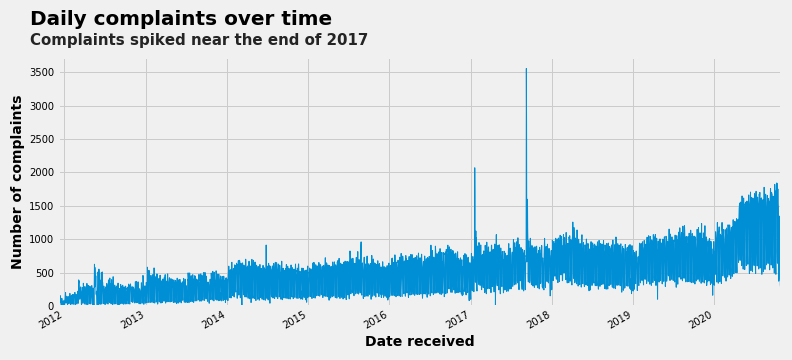
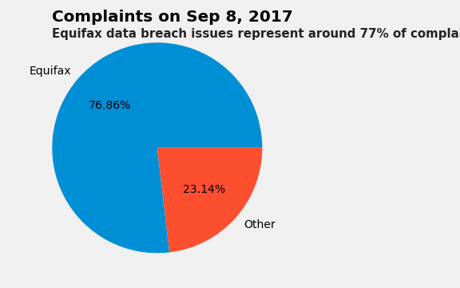
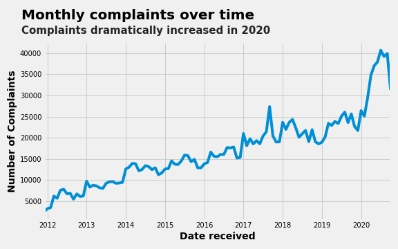

## Analysis of the CFPB Consumer Complaints Database

Navajas, D.

Download CFPB Data: http://files.consumerfinance.gov/ccdb/complaints.csv.zip

*The data file is over 1 GB and well above the limit set by GitHub. Please download the csv file from the link above and unzip it.

This project examines and analyzes the complaints database from the Consumer Financial Protection Bureau. The CFPB consumer complaint database was downloaded directly from the CFPB website. In order to re-use the code from this project and run the analysis, download the data from the website link, unzip "complaints.csv.zip" in the same folder as the Jupyter notebook code and then run it. 

The Consumer Complaint Database is a collection of complaints about consumer financial products and services that were sent to companies for response. Complaints are published either after the company responds, confirming a commercial relationship with the consumer, or after 15 days, whichever comes first.


## Analysis 

### Time series of daily number of complaints.



Over time the number of complaints have increased and we can see very clear spikes and outliers in the beginning and the end of 2017.

### What's up with the spike? 

One day before before the sudden peak, on September 7, 2017, Equifax announced a data breach, stating that hackers had access to the sensitive information of around 143 million Americans. The hackers had access to names, Social Security numbers, birth dates, addresses, driver's license numbers, credit card numbers, and other documents.



After examining the company complaints, the data was as expected, the spike in complaints on September 8, 2017 was largely due to the Equifax data breach. Complaints of Equifax represented around 77% of the complaints on that day, demonstrating that the data breach did lead to a large increase in credit reporting and related issues complaints. 

It is no surprise that, as a result, in 2017, Senators Warren and Schatz introduced the Freedom from Equifax Exploitation [(FREE)](https://www.congress.gov/bill/115th-congress/senate-bill/1816/text?q=%7B%22search%22%3A%5B%22SECURE+Act%22%5D%7D&r=3&s=9) Act to give consumers more control over their financial data and more tools to protect themselves. The FREE Act would require credit reporting agencies to provide customers with stronger fraud alert protections and an additional free credit report. 

Not long after, Senators Warren and Warner introduced the Data Breach Protection Prevention and Compensation Act of [2018](https://www.congress.gov/bill/115th-congress/senate-bill/2289/text?q=%7B%22search%22%3A%5B%22data+breach+notification+law%22%5D%7D&r=12&s=2), which would have passed penalites on companies that failed to adequately protect consumer data and require the FTC to set cybersecurity standards for credit reporting agencies. 

### Monthly complaints over time.



Looking at the data by the monthly number of complaints makes it even clearer that there is a huge spike in 2020. But what contributed to that? Let's check the product to see an explanation. 

### Complaints by product. 


The graph show clear spikes in 2017 and 2020 - due to the increase in complaints to the credit reporting, credit repair services, or other personal consumer reports. The graph makes it slightly difficult to see the other financial complaints by product, so let's check their distribution. Due to their clear spikes in the graph, let us compare 2017 to 2020. 

### Daily complaints by product - 2017 vs. 2020


In 2017, the median number of credit reporting and related issues is a little over 200 daily complaints. However, there are outliers in the daily number of complaints, with the max reaching over 3,000 daily number of credit reporting and related issues complaints. Interestingly, student loans had a significant number of outliers and a small median.


In comparison, in 2020, the median number of credit reporting and related issues shows a large shift and is closer to 700 daily complaints. However, there are no outliers as seen in the 2017 complaints distribution for the credit reporting related issues. Comparing the two graph also demonstrates that 2017 was not a typical year and that 2020 saw over a two-fold median increase in credit reporting and related issues complaints. 

### Response to consumers

After looking at the large spike in 2020 complaints, how did these companies respond to these complaints? 


We can see that 88% were closed with an explanation. Only 0.4% received an untimely response, which is low and a positive sign. Around 3% were closed with monetary relief, 6.6% were closed with non-monetary relief, and around 2% were in progress. The data shows that making complaints through the CFPB is not a lost cause or a waste of time; the likelihood that consumers will get a response is extremely likely. 

### Complaints by state

Let's examine the total number of complaints by seeing how the states match up against each other. Which states have the most complaints?



The number of complaints are not uniformly distributed across the US states. Not surprisingly, the more populous states tend to have more complaints. By hovering over the text, one can see that Florida had the largest number of complaints overall (45,992), followed by California (42,042), then Texas (37,062), New York (21,702), and then Georgia (20,861). The fact that Florida is at the top demonstrates that there is some other factor at play. A possible explanation might be the higher concentration of older Americans who live there, especially since they might be an easier target. 

### Complaints by the top 5 companies for 2020

Finally, let's see which companies account for the top number of complaints and how they compare against all others.



The top three firms that received the most number of complaints were all credit bureaus: Experian, Transunion, and Equifax. They were followed by the banks Capitol One and JPMorgan Chase, however, the difference between credit bureaus and banks were significant. Equifax received 7.5 times more complaints than Capitol One. Hovering over the bars will show the exact amount of the number of complaints received in 2020 for the top five companies and all others firms (grouped as Other).

### Conclusion

An analysis of the CFPB's complaints database and the nature of complaints provides insight into the financial products consumers are having issues with. The distribution of complaints across products was relatively stable between 2014 and 2016, however, there was a large increase in credit reporting complaints in 2017. The marked increase also occured in 2020 but at a much larger scale and peak. The 2017 increase was driven in part by the Equifax data breach. Equifax complaints accounted for almost 77% of the complaints on September 8, 2017. 

Historically, most consumer complaints involved credit reporting products and related issues, mortgage, and debt collection products. Mortgage products accounted for a significant portion of all complaints between December 2011 and December 2013. In the middle of 2013, when the CFPB began taking debt collection complaints, debt collection swiftly became the second most complained about product and cemented its place.

Mortgages continued to be the most complained about product between 2014 and the end of 2016, followed closely by debt collection and credit reporting issues. However, in 2017 the number of mortgage related complaints markedly declined and we can see a large boom in credit reporting and related issues which continues to rise in 2020. 
 
The data shows some positive news for consumers in that most of the complaints came back with a timely response, meaning that it can indeed be worthwile to make a complaint, especially for those who have been unsuccesful at getting an adequate response from companies. Regarding the breakdown of such companies, in 2020, there were complaints about 2,995 distinct companies. However, just the top 3 companies complaints accounted for around 55% of the total complaints, which is shocking. 

The data demonstrates that consumers are having increased problems with credit reporting and related issues. The trend is clear and one may predict that this trend will likely continue into the future. This sends a clear signal to the CFPB, legislators, and other interested parties that something needs to be fixed. Undoubtedly, financial firms and credit reporting agencies could come under the radar of regulators, especially after a change in political leadership and direction that looks more favorably at the CFPB's mandate. 


You can use the [editor on GitHub](https://github.com/dz777/dz777.github.io/edit/main/README.md) to maintain and preview the content for your website in Markdown files.

Whenever you commit to this repository, GitHub Pages will run [Jekyll](https://jekyllrb.com/) to rebuild the pages in your site, from the content in your Markdown files.

### Markdown

Markdown is a lightweight and easy-to-use syntax for styling your writing. It includes conventions for

```markdown
Syntax highlighted code block

# Header 1
## Header 2
### Header 3

- Bulleted
- List

1. Numbered
2. List

**Bold** and _Italic_ and `Code` text

[Link](url) and 
```

For more details see [GitHub Flavored Markdown](https://guides.github.com/features/mastering-markdown/).

### Jekyll Themes

Your Pages site will use the layout and styles from the Jekyll theme you have selected in your [repository settings](https://github.com/dz777/dz777.github.io/settings). The name of this theme is saved in the Jekyll `_config.yml` configuration file.

### Support or Contact

Having trouble with Pages? Check out our [documentation](https://docs.github.com/categories/github-pages-basics/) or [contact support](https://github.com/contact) and we’ll help you sort it out.
